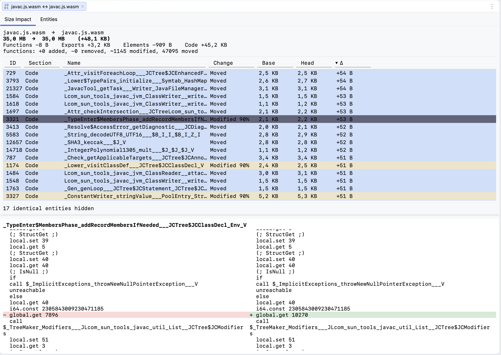
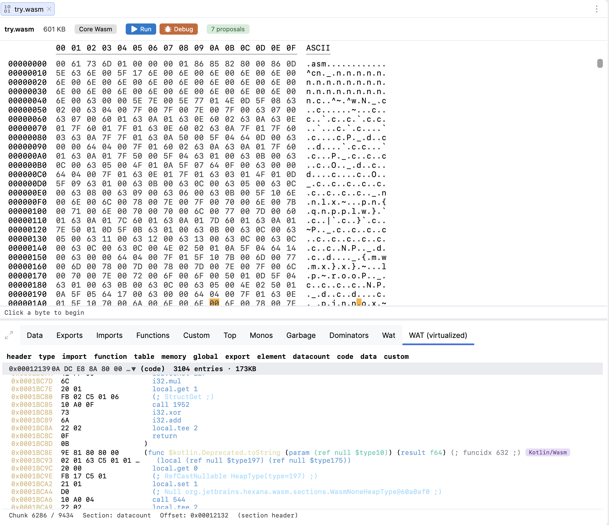
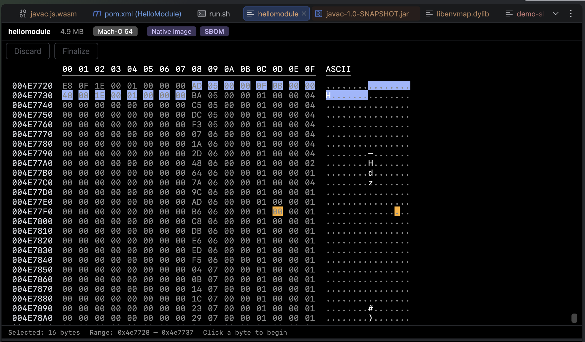
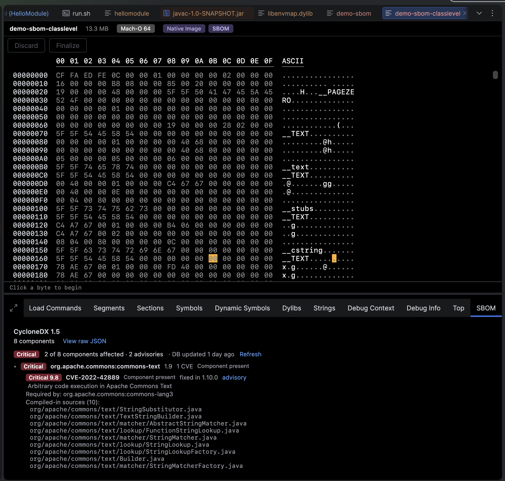

# Hexana 0.11 Release Notes

This page covers the **0.11 release line**: **0.11** (2026-06-11) and the **0.11.1** patch (2026-06-17).

- **0.11.1** adds a module-to-module WebAssembly diff — structural function matching, a supply-chain view of newly-introduced imports, and an on-demand WAT comparison — and recognises Kotlin/Wasm modules, badging functions and navigating to their Kotlin source declarations.
- **0.11** adds two new WebAssembly run/debug runtimes — Node.js and the browser — recognises GraalVM Native Image binaries, and reads their embedded CycloneDX SBOM, including matching components against the OSV vulnerability database and reporting which CVEs actually survived the image's dead-code elimination.

## 0.11.1 — Module diff and Kotlin/Wasm

Released **2026-06-17**. No breaking changes from 0.11.

### Compare two WebAssembly modules

**Compare WASM With…** — from a `.wasm` file's project-view context menu or the **Tools** menu — opens a diff editor for two modules.

- **Size Impact tab** — per-section and per-function byte deltas, sorted by impact. Functions are paired with a semantic matcher (content hash + call graph) rather than by position, so inserting or removing a function no longer mis-attributes byte deltas to unrelated functions. Each row shows the match classification — *identical*, *moved*, or *modified* — and, for non-exact matches, a confidence; a pure renumber is reported as *moved* (zero bytes) rather than a spurious size change.
- **Entities tab** — every entity kind (imports, exports, functions, globals, tables, memories, types, data and element segments) classified as added / removed / modified / moved, colour-coded with aligned columns. A **supply-chain banner** highlights newly-introduced imports, flagging host namespaces such as `env` and `wasi_*` — the "what can this module call into the host that the previous build couldn't" question after a dependency bump.
- **Structural matching robust to optimisation** — a second hashing round substitutes already-matched call targets, so a rewritten body that still calls the same functions is paired, and calls to imported functions help discriminate matches. Renaming or renumbering does not show up as churn.
- **Minified modules** — the diff detects minified import/export names (for example from Binaryen's `--minify-imports-and-exports`) and notes that matches are structural. Dropping a symbol-map sidecar — `<file>.symbols` next to the `.wasm`, as emitted by `--emit-symbol-map` — restores the original names so functions match by name again. Both map shapes are read: function-index (`index:name`) and import/export (`minified:original`, including Binaryen's `original => minified` console form).
- **On-demand WAT comparison** — selecting a function opens a side-by-side WAT diff rendered with symbolic names and standard red/green line-level highlighting, so an unchanged caller of a renumbered function reads identically.
- **Edit mode** gains highlighting of changes and an option to overwrite the file.

### Kotlin/Wasm detection and source navigation

- Modules compiled by the Kotlin/Wasm backend are detected by their `kotlin.wasm.internal.*` import fingerprint and tagged with a **Kotlin/Wasm** badge on the Functions tab and the virtualised WAT view.
- Clicking a function's badge navigates to its Kotlin source declaration, resolved from the plain fully-qualified names the Kotlin/Wasm backend writes into the name section. Constructors, property accessors, and `$default` / `$lambda` synthetics are handled; overloads that share a name resolve to the method declaration.
- Detection keys on the import *field-name* prefix rather than the host module, so it works across Kotlin versions (current `js_code`, older `env`) and does not misfire on GraalVM Web Image or Emscripten, which also emit WasmGC.

### Fixed

- The virtualised WAT view no longer throws `IllegalArgumentException: Key … was already used` (and freezes) when scrolling or navigating a module whose name section repeats a function name. Kotlin/Wasm emits the same name (`<init>`, property accessors, `$default`, overloads) at many function indices, so this affected Kotlin/Wasm modules in particular. Per-function chunk identity now disambiguates the collisions; this also fixes navigation that could land on the wrong same-named function, and fold state that collapsed across same-named functions. Custom-section headers with duplicate names are disambiguated the same way.

## 0.11 — Node.js / browser runtimes and GraalVM Native Image

Released **2026-06-11**.

### Node.js and browser runtimes

WASM run/debug configurations can now target **Node.js** and the **browser** (Chrome) in addition to Wasmtime, WAMR, and GraalWasm.

- **Run** under Node.js or the browser — Hexana generates the host glue and launches the module.
- **Debug** is supported for both: the browser path drives **Chrome** through the Chrome DevTools Protocol; Node.js uses its built-in inspector. (DWARF-backed `lldb` debugging via Wasmtime and WAMR is unchanged.)

See [`run-and-debug.md`](run-and-debug.md) for the full runtime matrix.

### GraalVM Native Image detection

Executables and shared libraries produced by `native-image` (ELF, Mach-O, PE) are recognised by their SubstrateVM fingerprint — the `com.oracle.svm.core.VM=GraalVM …` identity string, `.svm_*` / `__svm*` sections, and the `__svm_version_info` marker — and tagged with a **Native Image** badge. The tooltip reports the GraalVM version, edition, and target platform. Because the identity string lives in read-only data, detection survives release stripping.

### Embedded SBOM viewer

Native Image binaries built with `--enable-sbom` (default-on in Oracle GraalVM for JDK 25+) carry an embedded CycloneDX software bill of materials. Hexana adds an **SBOM** badge and a dedicated **SBOM** tab:

- A metadata header — subject, timestamp, generating tool.
- A searchable, sortable component table — type, group, name, version, licences, PURL.
- A **View raw JSON** action that shows the decompressed CycloneDX document.

### SBOM vulnerability reachability

The SBOM tab can match its components against the **OSV** vulnerability database and overlay known CVEs with CVSS severity, the fixed version, and an advisory link.

- Because a component only appears in the SBOM if `native-image` retained it, **every CVE shown is for code that actually survived dead-code elimination** — not a vulnerability in a dependency the image dropped.
- Binaries built with `--enable-sbom=class-level` embed a compiled-in class/method tree; for those, Hexana refines the verdict to **"vulnerable class retained"** vs **"eliminated by DCE"**.
- Matching is **offline by default** — the OSV database is downloaded once and the component list never leaves your machine. An opt-in toggle additionally queries `api.osv.dev` online.

Both toggles live under **Settings → Tools → Hexana** and are **off until enabled**. See [`settings.md`](settings.md#sbom-vulnerability-matching).

### Changed

- **WASM debugging on Windows** — more reliable breakpoint handling. If breakpoints did not bind on Windows for you before, they should now.

## Patch releases since 0.10

These patch releases shipped between 0.10 and 0.11:

- **0.10.3** (2026-06-10) — statistics-reporting fix.
- **0.10.2** (2026-06-03) — GraalVM Web Image `.wasm` detection with a **Java** badge that jumps to the originating Java bytecode; the `.jit` viewer split into Combined / Bytecode / Machine Code tabs with per-tab copy and Go-To-Offset; search compiled methods by inlined callee (`in:<method>`); an **Instrument JMH forks** option that attaches the JIT dump agent to each forked JMH JVM; foldable custom sections in the virtualised WAT view; and several large-binary responsiveness fixes (Top tab, WasmGC `(rec …)` type groups, WAT rebuild-on-recomposition).
- **0.10.1** (2026-05-29) — list entries for plain ZIP files, a missing scrollbar on the archive entry list, and JIT-binary open fixes.

## Upgrading

### To 0.11.1 (from 0.11)

No breaking changes.

- **Compare WASM With…** and **Kotlin/Wasm** detection are automatic; they add an action and badges and never displace an existing editor. The module diff runs entirely on your machine — nothing is sent anywhere.
- The symbol-map sidecar for de-minified matching is opt-in: drop a `<file>.symbols` file next to the `.wasm` only if you have one.

### To 0.11 (from 0.10)

No breaking changes.

- Existing run configurations continue to work. The new Node.js / browser runtimes are additional choices in the runtime picker.
- Native Image detection and the SBOM tab are automatic for matching binaries; they add tabs and badges and never displace an existing editor.
- SBOM vulnerability matching is **off by default** — no database is downloaded and nothing is sent anywhere until you enable it in Settings.

## Known limitations in 0.11

- The SBOM features apply to **GraalVM Native Image** binaries only — a native binary without an embedded SBOM gets the disassembly view but no SBOM tab.
- The online OSV query sends the component coordinate list to `api.osv.dev`; it is off unless you explicitly enable it (and requires the offline matcher to be on first).
- Browser debugging targets **Chrome** (via the Chrome DevTools Protocol). Other browsers are not yet wired for debug.
- Carryover from 0.10: native-binary support is experimental; the Cranelift / Redline disassembler backend is experimental; Java integration covers Java sources only; quick-fixes are not yet wired on the WebAssembly Java or WIT inspections.

## Earlier releases

- [Hexana 0.10 release notes](changelog-0.10.md) — 0.10 (2026-05-27), plus the 0.10.1–0.10.3 patch line summarised above.
- [Hexana 0.9 release notes](changelog-0.9.md) — 0.9 (2026-05-07), 0.9.1 (2026-05-20).
