# Hexana Feature Reference

This page enumerates every user-visible capability Hexana ships. Capabilities are grouped by *surface* (file type or interaction point), not by chronological release. For per-release changes, see [`changelog-0.11.md`](changelog-0.11.md), [`changelog-0.10.md`](changelog-0.10.md), and the prior [`changelog-0.9.md`](changelog-0.9.md).


## WebAssembly module viewer

When Hexana opens a `.wasm` file, it presents a structured editor with the following tabs.

### Module overview tab
- Magic bytes (`\0asm`) and binary format version display.
- Section table with id, size, and offset for every section.
- Custom-section list, including DWARF (`.debug_*`) and name sections.
- Detection of the module kind: core WebAssembly module vs. Component Model component.
- Backreference to the containing module when the opened file is a nested module inside a component.

### Imports tab
- Imports grouped by kind (function, table, memory, global, tag).
- Resolved type signature per imported function.
- Click an entry to jump to its hex offset in the **Hex** tab.
- Search-as-you-type filter across import names.

### Exports tab
- Exports listed with the resolved target index and kind.
- Goto Symbol contributes export names project-wide.
- Click an entry to jump to its hex offset.

### Functions tab
- One row per defined function with index, type signature, local count, and code-section offset.
- Searchable, sortable, keyboard-navigable.

### Top tab — size profiler

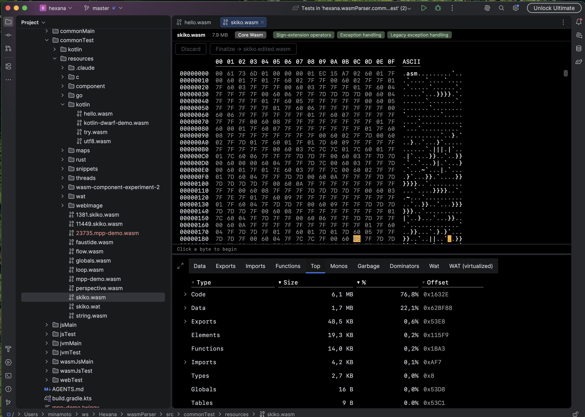

- Sortable table of the largest functions, data segments, and sections by byte size.
- Click a row to navigate to the corresponding hex range.
- Useful first stop when "the binary got bigger" — the top of the list is where the bytes went.

### Hex tab
- Byte-level view with section annotations.
- Text and hex panels with selection synchronised between them.
- Arrow-key navigation.
- Incremental search across the binary, including raw byte patterns.
- `hexana.goToOffset` (shares `Cmd/Ctrl+L`) jumps to a byte offset.
- `hexana.showStructurePopup` (shares `Cmd/Ctrl+F12`) opens a structure outline.
- Clickable hex offsets in the WAT tab navigate here.

### WAT tab — virtualised, editable

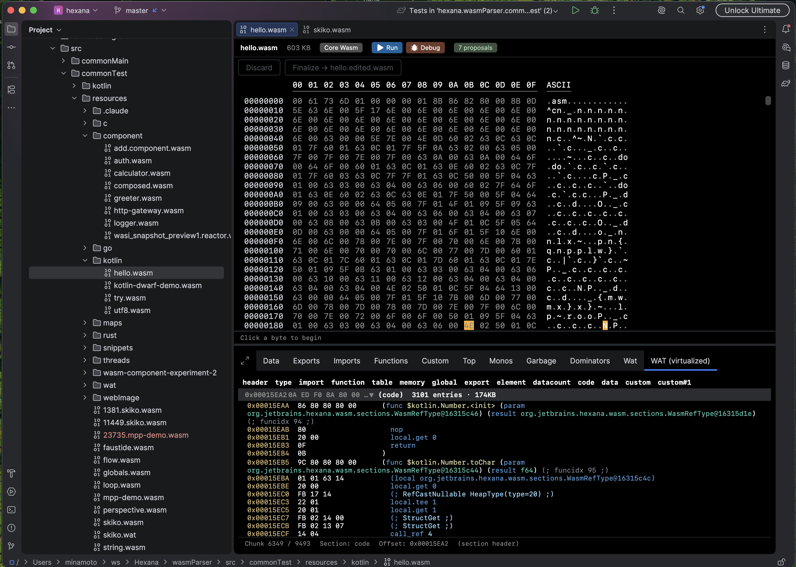

- Rendered WebAssembly Text format with offsets-based line numbers.
- Sections fold individually; a **section shortcut bar** at the top of the panel jumps directly to Function, Data, Import, or Export ranges.
- Sticky function headers; per-function and per-section fold state survives scroll.
- Syntax highlighting and brace matching; IDE zoom respected.
- Reference-types and bulk-memory instructions rendered.
- Legacy Exception Handling (`try`, `catch`, `throw`, `rethrow`, `delegate`, `catch_all`) supported alongside the finalised `try_table` proposal.

#### Inline row editing

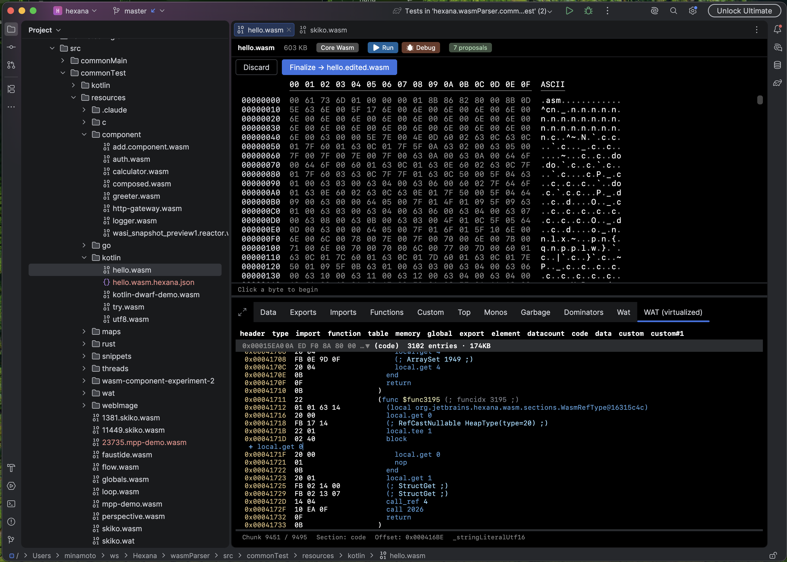

- Click an instruction row to enter an inline edit; press Enter to commit.
- Length-changing edits (replacing a 1-byte instruction with a 3-byte one) cascade through the WASM encoder so section sizes, function tables, and DWARF offsets stay coherent.
- Hex-cell edits in the **Hex** tab follow the same commit cycle.
- Undo / Redo follow the IDE keymap (`Cmd+Z` / `Cmd+Shift+Z` by default on macOS).
- **Discard** reverts every uncommitted edit back to the original bytes; **Finalize** writes the edited bytes to a sibling `<name>.edited.wasm` file.
- Edits persist across IDE restarts via a `<name>.hexana.json` sidecar next to the original file; reopening the file replays the journal on top of the original bytes (with hash verification so a stale sidecar is detected rather than blindly applied).

#### Data section view modes

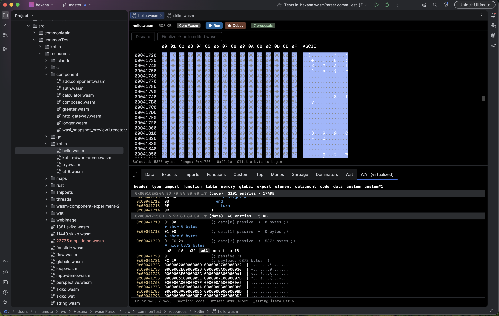

- Switch between `u8`, `u16`, `u32`, `u64`, `ascii`, and `utf8` renderings per data chunk.
- Expand and collapse data bodies independently of their containing section.
- Per-chunk view-mode choice persists across recompositions within a session.

### Information bar

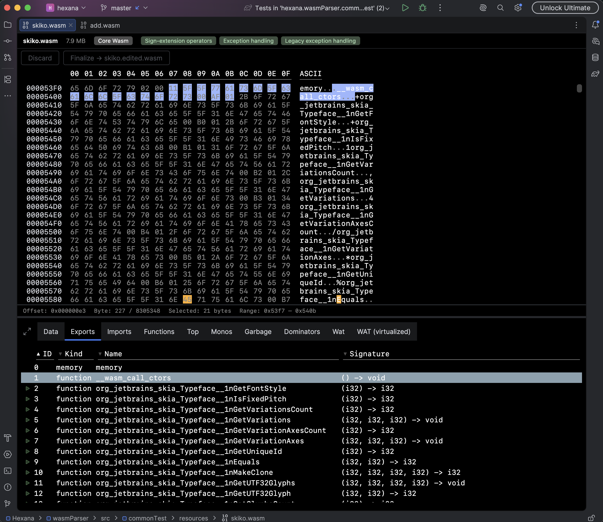

- File size (hover for per-section breakdown).
- Module kind (core / component).
- **Proposal pills** showing which WebAssembly proposals the binary uses — Threads, SIMD, GC, Tail Call, Reference Types, Bulk Memory, and so on. Hexana detects them and propagates the matching `--wasm-features` (or runtime-equivalent) flags to run / debug commands automatically.
- Run and Debug buttons when a runtime is configured.
- Backreference link to a parent component when applicable.
- Format badges where applicable — e.g. **Native Image** and **SBOM** on GraalVM Native Image binaries (see [GraalVM Native Image](#graalvm-native-image-011)).

## WIT language support

Hexana registers a full `wit` Language with the IntelliJ Platform. The complete WIT feature surface is documented in [`wit-language.md`](wit-language.md). Headlines:

- Lexer, parser, and PSI for the WIT grammar.
- Syntax highlighting and semantic keyword highlighting.
- Brace matching, code folding, breadcrumbs.
- Code formatter and line-wrap strategy.
- Keyword completion and `@gate` completion.
- 5 inspections: empty definition, world name uniqueness, missing semicolon, gate validation, use-declaration missing names.
- Find Usages with a dedicated handler factory.
- Rename validation.
- Goto Symbol contributes WIT declarations.
- Documentation provider for WIT elements.
- Built-in WIT type definitions indexed and resolved.
- Component-Model index for cross-file resolution.
- Line-marker provider for related-symbol navigation.

## WAT language support

- File type and language registered for `.wat`.
- Parser definition, syntax highlighter, brace matcher.
- File-view provider factory.
- Problem-highlight filter.
- Use-scope optimizer for performance on large WAT files.
- Documentation target provider.
- Find Usages handler factory.
- File-size checker that gates expensive operations on very large files.

## Hex view and binary file type

- Hexana registers a generic binary file type covering `.bin` and similar generic-extension files. These open in the hex view directly.
- File-type overrider claims `.wasm`, `.wat`, `.wit` for Hexana.
- A separate magic-byte detector claims ELF, Mach-O, PE, and other native-binary formats — see [Native binaries](#native-binaries-experimental).

## Native binaries (experimental)

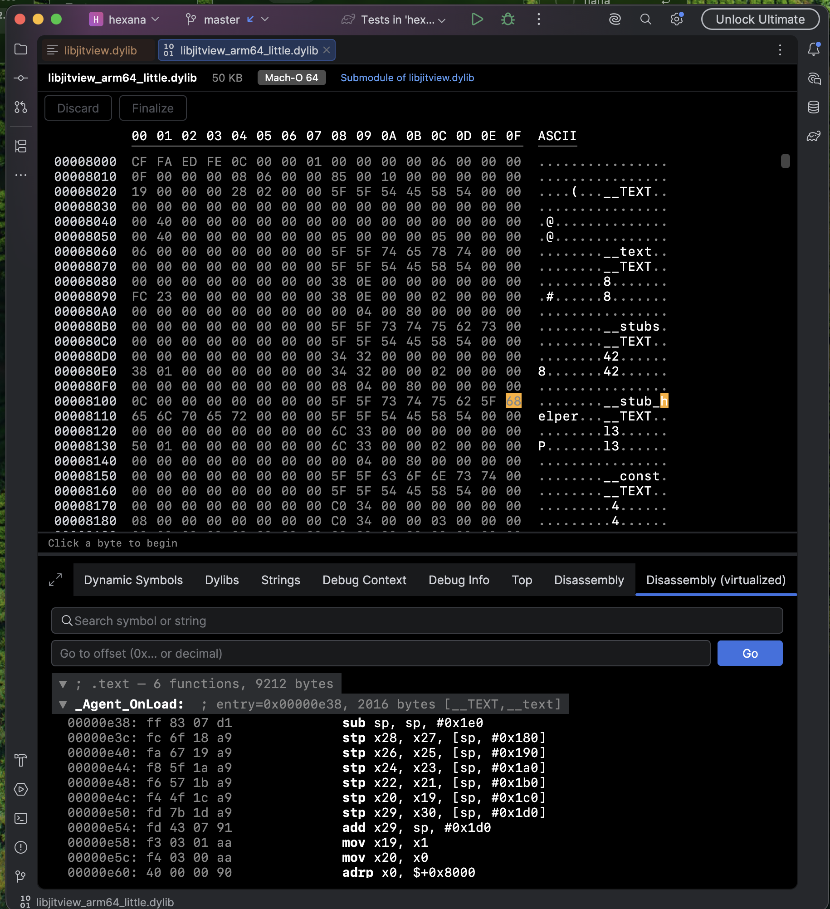

Hexana detects ELF, Mach-O, and PE binaries from their magic bytes regardless of extension. The same hex + structure layout applies as for WebAssembly modules, plus a dedicated **Disassembly** tab.

- **Format coverage** — ELF (`.elf`, `.so`), Mach-O (`.dylib`, `.bundle`), PE (`.exe`, `.dll`, `.sys`), plus fat Mach-O and `.a` archives.
- **Multi-architecture disassembly** — x86, x86-64, ARM, AArch64, RISC-V 32 and 64. The disassembler ships as a bundled Rust / WebAssembly module — no host `objdump`, Capstone, or similar toolchain required.
- **Virtualised rendering** — function bodies are sub-chunked by instruction window; only the visible portion is decoded and laid out. Even multi-megabyte `.text` sections render incrementally.
- **Symbol-driven function discovery first**, with a fallback to per-executable-section ranges when symbols are stripped.
- **Switchable disassembler backend** — by default the bundled Capstone module runs as compiled JVM bytecode; an experimental Cranelift-native path is available via a Registry toggle. See [`disassembler-backends.md`](disassembler-backends.md).

### GraalVM Native Image (0.11)


Native executables and shared libraries produced by `native-image` are a recognised sub-kind of native binary.

- **Detection** — Hexana fingerprints the SubstrateVM build: the `com.oracle.svm.core.VM=GraalVM …` identity string, `.svm_*` / `__svm*` sections, and the `__svm_version_info` marker. Matching binaries get a **Native Image** badge whose tooltip reports the GraalVM version, edition, and target platform. Because the identity string lives in read-only data, detection survives release stripping.
- **Embedded SBOM** — binaries built with `--enable-sbom` (default-on in Oracle GraalVM for JDK 25+) get an **SBOM** badge and a dedicated **SBOM** tab: a metadata header (subject, timestamp, generating tool) over a searchable, sortable component table (type, group, name, version, licences, PURL), with a **View raw JSON** action for the decompressed CycloneDX document.

#### SBOM vulnerability reachability


The SBOM tab can match components against the **OSV** database and overlay known CVEs with CVSS severity, the fixed version, and an advisory link.

- A component only appears in the SBOM if `native-image` retained it, so every CVE shown is for code that actually survived dead-code elimination.
- With `--enable-sbom=class-level`, Hexana uses the compiled-in class/method tree to refine the verdict to **"vulnerable class retained"** vs **"eliminated by DCE"**.
- Matching is **offline by default** (the OSV database is downloaded once; the component list never leaves your machine), with an opt-in online `api.osv.dev` query. Both toggles are off until enabled in **Settings → Tools → Hexana** — see [`settings.md`](settings.md#sbom-vulnerability-matching).

## JVM artifacts

Hexana opens Java archives, class files, and Hotspot JIT dumps as structured documents.

### Class files

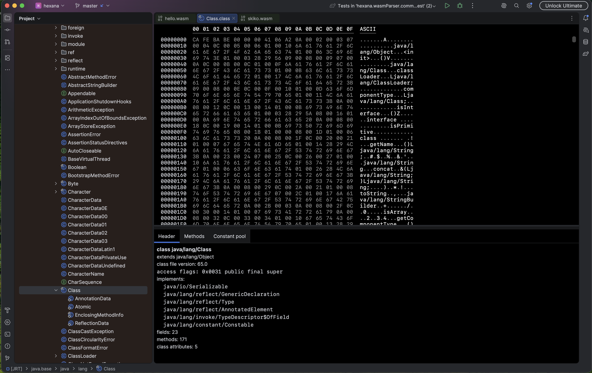

`.class` files render as a three-tab view: header (access flags, parent class, interfaces), methods (with decoded bytecode), and constant pool. Each tab is searchable and keyboard-navigable.

### Archives — JAR, WAR, APK, ZIP

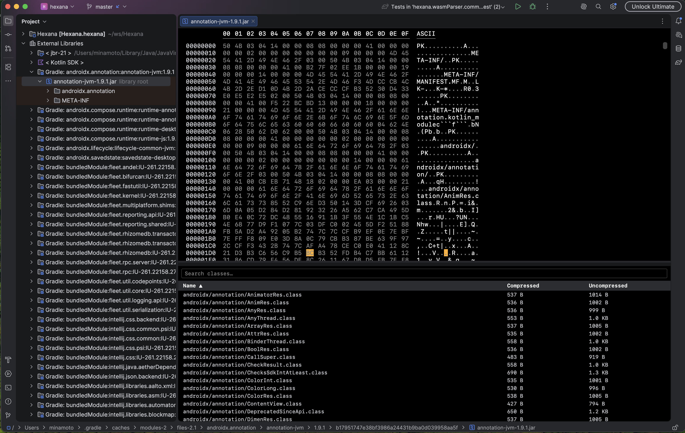

`.jar`, `.zip`, `.war`, `.apk` archives open with a hex view on top and a searchable, sortable class list below. Click a class to open its decoded bytes in a nested tab. An **Open in… → Hexana** action surfaces from the Project tool window for archive entries, including entries under External Libraries.

### JIT dumps

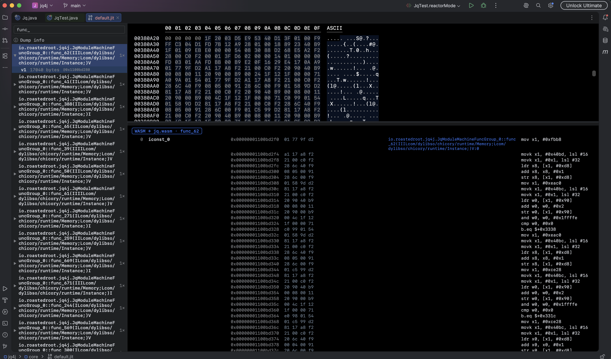

`.jit` dumps produced by Hexana's bundled JVMTI agent open in a three-pane view: symbol tree on the left, native bytes for the selected method on the top right, decoded JVM bytecode and inline-tree on the bottom right.

The agent is opt-in per Java run configuration — check **Hexana JIT Viewer** in the run-configuration editor. The agent attaches at JVM startup, records each `CompiledMethodLoad` event into a configurable dump file (`default.jit` by default), and Hexana auto-opens the dump when the run completes.

## Run configurations and debugging

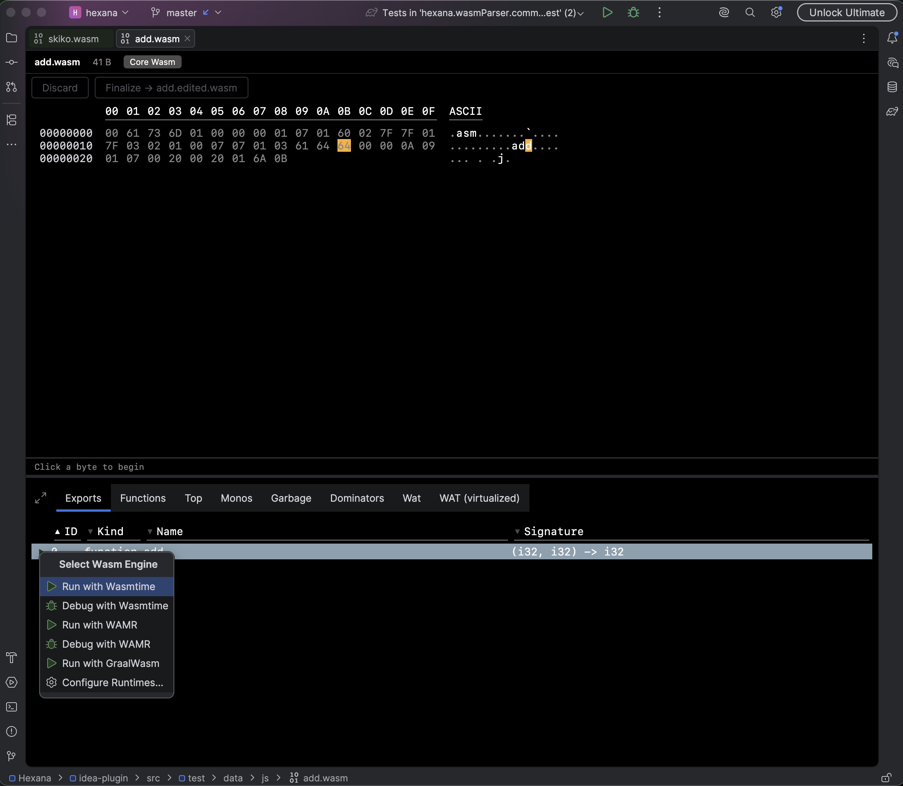

Hexana ships a `WasmRunConfigurationType` with a producer that creates a run configuration from any open `.wasm` file. Supported runtimes:

- **Wasmtime** — run and debug (debug requires LLVM 22.1+).
- **WAMR** — run and debug.
- **GraalWasm** (built-in or custom GraalVM installation) — run only. Builds of GraalVM without the embedded WASM runner are detected and supported.
- **Node.js** — run and debug (0.11). Debugging uses Node's built-in inspector.
- **Browser** — run and debug (0.11). Debugging drives **Chrome** via the Chrome DevTools Protocol.

The runtime is selected per-project in **Settings → Build, Execution, Deployment → WASM Runtime**. The configuration also accepts a custom GraalVM home directory. See [`run-and-debug.md`](run-and-debug.md).

Hexana detects which WASM proposals a module uses (Threads, SIMD, GC, EH, etc.) and propagates the correct `--wasm-features` (or runtime-equivalent) flags automatically. Debugging via DWARF works against breakpoints set in the source files the binary was compiled from, including when debug information is encoded in `.debug_loc` sections.

The debugger is registered via `WasmDebugRunner` and `WasmLineBreakpointType`; breakpoints are placed on WAT lines and back-mapped through DWARF when available.

## MCP server

Hexana registers `HexanaToolset` against the platform MCP server (`com.intellij.mcpServer`). 17 tools at 0.9, in canonical order:

```
summarize_module, list_imports, list_exports, list_globals,
list_types, list_memory, list_element_segments, list_functions,
functions_for_indices, get_globals_for_indices,
get_memory_for_indices, get_types_for_indices,
get_locals_for_functions, get_instructions_for_functions,
list_exported_functions, list_data, list_data_segments
```

Each tool is documented per-section in [`mcp-tools.md`](mcp-tools.md).

## Java-side WebAssembly API support

Loaded when the host IDE includes the Java module (`com.intellij.modules.java`). Hexana 0.9 contributes:

- **GraalWasm completion** for `org.graalvm.polyglot.*` calls that load WASM (`Source.newBuilder("wasm", url)`, `Context.eval(...)`, `module.newInstance(ProxyObject.fromMap(Map.of(...)))`, `getMember`/`invokeMember`).
- **Chicory completion** for `com.dylibso.chicory.*` calls (`Parser.parse(...)`, `Instance.builder(...)`, `instance.export("...")`, `ExportFunction.apply(...)`, `new HostFunction(...)`, `Store.addFunction`, `ImportValues`, `FunctionType.of(...)`).
- **`JavaWasmReferenceIndex`** indexes Java string literals that name `.wasm` exports / imports and resolves them across files.
- **Five inspections**:
  - `WasmExportInspection` — unresolved WebAssembly export name.
  - `WasmExportArgCountInspection` — export argument count mismatch.
  - `WasmExportArgTypeInspection` — export argument type mismatch.
  - `WasmImportInspection` — unresolved WebAssembly import name.

See [`java-integration.md`](java-integration.md).

## JavaScript and TypeScript integration

Loaded when the host IDE includes the JavaScript plugin (WebStorm by default; opt-in for IntelliJ IDEA, RustRover, PhpStorm, Rider). Hexana 0.9 contributes a `WasmFrameworkIndexingHandler` that hooks into the JetBrains JS type-inference pipeline and provides:

- **Imports completion** inside the second argument of `WebAssembly.instantiate(...)` / `instantiateStreaming(...)` — module names and per-module item names typed against the resolved `.wasm`'s real imports.
- **Exports type inference** on `.instance.exports.<name>` — function exports become typed callables with argument-count and argument-type checking; memory, table, and global exports get the right `WebAssembly.*` types.
- **Literal-union argument types** — when a WASM function branches on a string-literal argument, the parameter is typed as the literal union (e.g. `"add" | "sub"`), not just `string`.
- **`compile` / `compileStreaming` support** — `WebAssembly.Module` returned by `compile(...)` carries the resolved path forward into a later `new WebAssembly.Instance(module, imports)`.
- **`fetch` heuristic** — when instantiating from an `ArrayBuffer`, Hexana traces a sibling `fetch("…wasm")` call to identify the source binary.
- **TypeScript-aware** — recognises `WebAssembly.Instance` / `Module` / `WebAssemblyInstantiatedSource` resolved through TypeScript's `WebAssembly` namespace.
- **Application-level cache** (`WasmBinaryDataCacheService`) — each `.wasm` is parsed once and reused across all JS resolves in the session.

See [`js-integration.md`](js-integration.md) for the full reference.

## Indexes

Hexana ships four file-based indexes:

| Index | Purpose |
|---|---|
| `WasmIndex` | Maps `.wasm` file content into a queryable module representation. Used by Goto Symbol, run-config producer, MCP tools, and Java/JS integrations. |
| `WasmExportIndex` | Symbol index keyed by export name → owning `.wasm` file. |
| `DwarfIndex` | Indexes DWARF debug information for source mapping. |
| `WitComponentIndex` | Cross-file index for WIT component declarations. |
| `JavaWasmReferenceIndex` | Java string-literal → WASM export/import resolver (Java module only). |

JavaScript-side resolution is not file-based; it uses the application-level `WasmBinaryDataCacheService` instead. See [`js-integration.md`](js-integration.md).

## DWARF debug information

Hexana parses DWARF v4 and v5 sections embedded in `.wasm` custom sections:

- `.debug_str` — string table, original offsets preserved.
- `.debug_abbrev` — abbreviation tables.
- `.debug_info` — compilation units, DIE trees.
- `.debug_line` — line-number programs.

Used by the debugger for source-line mapping (via `WasmDwarfInjector` and `WasmDwarfUtil`) and by the **Source mapping** feature (added 0.8) which lets the user navigate from WAT back to the source file the binary was compiled from when DWARF is present.

## Goto Symbol contributor

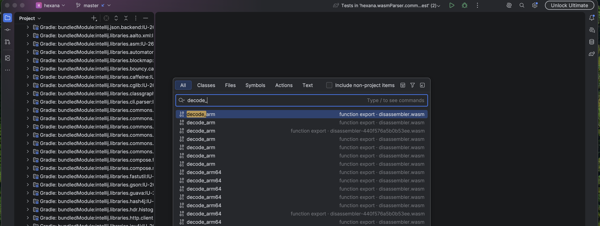

Hexana adds a `gotoSymbolContributor` (`HexanaGotoSymbolContributor`) that surfaces:

- `.wit` interface, world, and type declarations.
- Component-model exports.
- Regular `.wasm` exports — picking one opens the file and selects the matching row in the Exports tab.

`Shift+Shift` (Search Everywhere → Symbols) finds all of the above alongside regular code symbols.

## Notifications

Hexana registers the `hexana` notification group (balloon display). Currently used for the `MissingWasmToolsNotification` editor notification that surfaces when a `.wat` file is opened but Hexana cannot find the binary tooling needed to operate on it.

## Settings pages

Two registered `applicationConfigurable` entries (see [`settings.md`](settings.md)):

- **Tools → Hexana** — general Hexana settings.
- **Build, Execution, Deployment → WASM Runtime** — runtime selection (Wasmtime, WAMR, GraalVM), runtime paths, default-runtime configuration.

## Usage statistics

`HexanaCounterUsagesCollector` registers event group `org.jetbrains.hexana` (recorder `FUS`) with one event in 0.9: `wasm.file.opened`. Subject to the IDE's standard statistics-collection consent.
