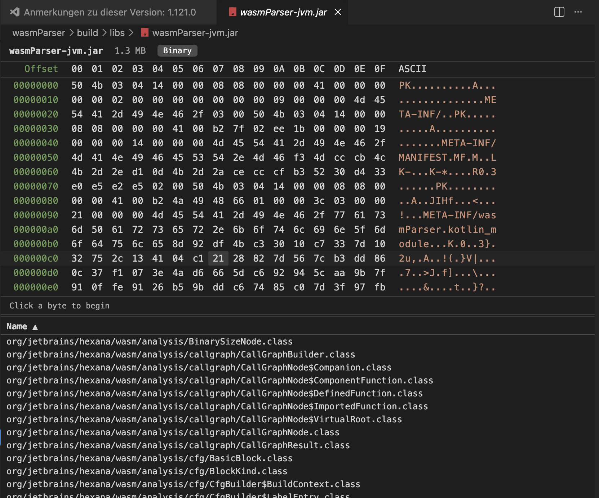

# Hexana for VS Code — Feature Reference

This page enumerates every user-visible capability Hexana ships for VS Code. For per-tab details on the analysis panels, see [`analysis-tabs.md`](analysis-tabs.md). For per-release changes, see [`changelog.md`](changelog.md).

## Custom binary editor

Hexana registers a `CustomReadonlyEditorProvider` (`hexana.wasmEditor`) for files matching `*.wasm`. When you open a `.wasm`, VS Code uses this editor by default — `workbench.editorAssociations` is set to `{"*.wasm": "hexana.wasmEditor"}` automatically on install.

The editor is **read-only**. Inspection and run; no in-place editing.

### Automatic binary kind detection

Four kinds are detected and badged in the editor toolbar:

| Badge | Detection |
|---|---|
| `core` | Standard core WebAssembly module (magic `\0asm`, version 1). |
| `component` | Component Model binary (magic `\0asm`, version 0x0a, layer 1). |
| `wasm` | Falls back to generic when neither kind matches but the file is otherwise WebAssembly. |
| `native` | ELF, Mach-O, or PE binary detected from magic bytes. |

Tab availability adapts per kind — Component Model files surface a **Modules** tab; core modules surface **Functions**, **Data**, **Custom**, **Monos**, **Garbage**; native binaries surface a structure tab covering sections, segments, and symbols.

## Hex viewer

A virtual-scrolling hex dump with:

- **Byte selection**: click, `Shift+Click`, drag.
- **Keyboard navigation**: arrow keys move the caret; `Shift+Arrow` extends selection.
- **Text search** (`Cmd/Ctrl+F`): incremental search across the hex dump.
- **Selection status bar**: shows the current byte range and decoded interpretations.

The viewer renders through Compose-for-Web inside a VS Code webview — it scales smoothly to large files without DOM-node-per-byte overhead.

## Native binaries (experimental, 0.2.0+)

Hexana detects **ELF**, **Mach-O**, and **PE** files by magic bytes and opens them in the same custom editor as `.wasm` files. The hex viewer behaves identically; the structure tab surfaces format-specific information:

- **ELF**: sections, segments, dynamic symbols, imports.
- **Mach-O**: load commands, segments, sections, symbols.
- **PE**: headers, sections, exports, imports.

Common extensions are recognised (`.elf`, `.so`, `.dylib`, `.bundle`, `.exe`, `.dll`, `.sys`); extensionless binaries with matching magic bytes also open through the Hexana editor. Run and Debug are not applicable for native binaries.

## JVM archives (0.3.0+)

`.jar`, `.zip`, `.war`, and `.apk` archives open in the Hexana editor with the hex viewer on top and a **sortable, searchable entry list** below.

- Click an entry that is itself a recognised binary — `.wasm`, `.class`, a native binary, or a nested archive — to open it in a new Hexana editor tab.
- Decompression happens in the extension host; entries are read on demand, so large archives open without unpacking everything up front.

The decoded three-tab `.class` view (header / methods / constant pool) remains JetBrains-only — in VS Code a `.class` entry opens in the hex viewer. See [What this version does not do](#what-this-version-does-not-do-yet).

## Analysis tabs

Up to 11 tabs inside the same editor, surfaced by binary kind. All tables are **sortable** and **searchable**. See [`analysis-tabs.md`](analysis-tabs.md) for the per-tab reference.

| Tab | Core Wasm | Component | Generic |
|---|---|---|---|
| Summary | ✓ | ✓ | ✓ |
| Exports | ✓ | ✓ | — |
| Imports | ✓ | ✓ | — |
| Functions | ✓ | — | — |
| Data | ✓ | — | — |
| Custom | ✓ | — | — |
| Top | ✓ | ✓ | — |
| Monos | ✓ | — | — |
| Garbage | ✓ | — | — |
| Modules | — | ✓ | — |
| WAT | ✓ | ✓ | — |

## Run support

A **Run** button and a separate **Debug** button in the editor toolbar, present when at least one runtime is discoverable.

- **Runtime picker** — Wasmtime, WAMR, GraalVM, Node.js, or the browser (Node.js and browser added in 0.3.0, run-only). Unavailable runtimes are greyed out with a tooltip explaining why.
- **Core modules**: pick an export, the runtime, and supply arguments. Hexana invokes the chosen runtime in a VS Code terminal with auto-generated import stubs and the runtime's equivalent of `--preload` for data segments.
- **Component Model binaries**: Hexana resolves imports by scanning workspace directories for matching `.wasm` files (transitively), composes the result through `wasm-tools compose` or `wac plug`, then invokes the chosen runtime on the composed component.

See [`run-support.md`](run-support.md) for the full reference.

## Debugging (experimental)

A **Debug** button alongside Run launches the module under `lldb` for **Wasmtime** or **WAMR** runtimes (not GraalVM, Node.js, or the browser — those are run-only in VS Code). Requires LLVM 22.1 or newer.

- Set breakpoints in source files associated with the module (PC ↔ source mapping via DWARF).
- Step over, into, out; continue past hit breakpoints.
- Inspect local variables for compilers that emit DWARF with usable location expressions (Rust, C/C++, Emscripten with `-g`).
- Component Model nested-module breakpoints are supported on Wasmtime.

See [`run-support.md`](run-support.md) for the full reference and known limitations.

## MCP server (downloaded on demand)

Hexana integrates with VS Code's **Model Context Protocol server registration API**: AI tooling (Claude Desktop, Claude Code, Codex, Cursor's agent mode, Continue) can connect to the Hexana MCP server to inspect the currently open WASM file.

- **First-run download.** On first MCP use, Hexana downloads the standalone MCP server ZIP from the corresponding GitHub release and extracts it to `globalStorage`. Subsequent launches reuse the cached install. Stale download locks are detected and recovered automatically.
- **`Hexana: Reinstall MCP Server` command** (Command Palette) — re-runs the download to recover from a corrupted install or to re-pull after a Hexana update.
- **Java requirement.** The MCP server runs on Java 21+. Hexana looks at `JAVA_HOME`, `PATH`, and the `hexana.mcp.javaHome` setting; if no suitable JDK is found, MCP fails to start with an actionable error and Run / Debug are unaffected.

## Component Model support

- **Automatic dependency resolution** — when a component imports interfaces from other components, Hexana searches the workspace for matching `.wasm` files and resolves the dependency graph transitively. No manual wiring.
- **Nested-module navigation** — components carry nested modules; Hexana exposes them through a virtual filesystem provider, so each nested module opens in its own editor tab via a deterministic URL.
- **Submodule → parent backreference** — when you open a nested module, the editor toolbar shows a link back to the containing component.

See [`component-model.md`](component-model.md).

## Settings

Three settings under **Settings → Extensions → Hexana**:

| Setting | Default | Effect |
|---|---|---|
| `hexana.enableStatistics` | `true` | Toggle anonymous usage statistics collection. When `false`, no analytics events are sent regardless of the global VS Code telemetry setting. |
| `hexana.wasmtimePath` | `""` | Override the Wasmtime executable path. Empty = use whatever is on `PATH`. |
| `hexana.mcp.javaHome` | `""` | Override the JDK used to launch the on-demand MCP server. Empty = use `JAVA_HOME` / `PATH`. JDK 21+ required for MCP. |

See [`settings.md`](settings.md).

## Telemetry

Hexana collects anonymous usage statistics through PostHog, gated by both:

1. The global VS Code telemetry setting (`vscode.env.isTelemetryEnabled`).
2. The Hexana-specific `hexana.enableStatistics` setting (default `true`).

Both must be on for any event to be sent. Toggling either at runtime takes effect immediately (no restart) — the analytics client flushes pending events and reinitialises.

A consent notice is shown on first activation. JetBrains' privacy notice applies: `https://www.jetbrains.com/legal/docs/privacy/privacy/`.

See [`settings.md#telemetry`](settings.md).

## Resizable layout

Drag the divider between the hex viewer and the analysis panel to adjust the split. The layout persists across editor reopens.

## Indices and parsing

- Hexana parses `.wasm` binaries in the **webview** using the shared `wasmParser` and `binaryProvider` Kotlin Multiplatform modules. No external service or network request.
- Parsing is **streaming-friendly** — large modules (multi-MB) render incrementally.
- The extension host (TypeScript) handles VS Code-specific I/O; all WASM logic lives in Kotlin/JS layers.

## What this version does not do (yet)

Compared to the JetBrains IntelliJ plugin, the VS Code extension does **not** ship:

- WIT language support (parser, inspections, completion, navigation).
- Editable WAT view.
- Java-side completion / inspections for GraalWasm or Chicory.
- JS / TS-side type inference for `WebAssembly.instantiate`.
- GraalVM, Node.js, and browser debug (debug works on Wasmtime + WAMR only; Node.js and the browser are run-only).
- Goto Symbol contribution scoped to `.wit` declarations and `.wasm` exports.
- Decoded JVM artifact views — the three-tab `.class` view and the `.jit` viewer — and the switchable AOT / Cranelift disassembler backend. (Archives `.jar` / `.zip` / `.war` / `.apk` *do* open with a hex + entry list since 0.3.0; nested `.class` entries open in the hex viewer, not the decoded class view.)

These are tracked for future versions; some are JetBrains-only by design (where they depend on IntelliJ Platform APIs without a VS Code equivalent).

## See also

- [`getting-started.md`](getting-started.md), [`analysis-tabs.md`](analysis-tabs.md), [`run-support.md`](run-support.md), [`component-model.md`](component-model.md), [`settings.md`](settings.md), [`troubleshooting.md`](troubleshooting.md).
- [JetBrains plugin documentation](../jetbrains/index.md) for the IntelliJ-side capabilities.
